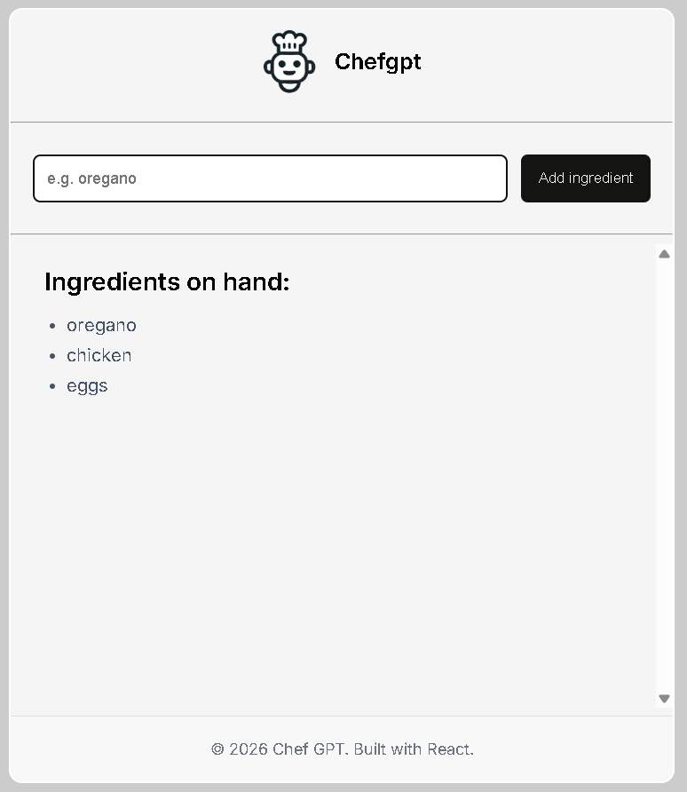
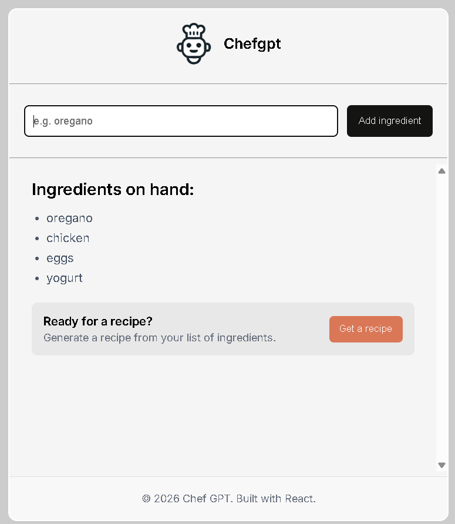
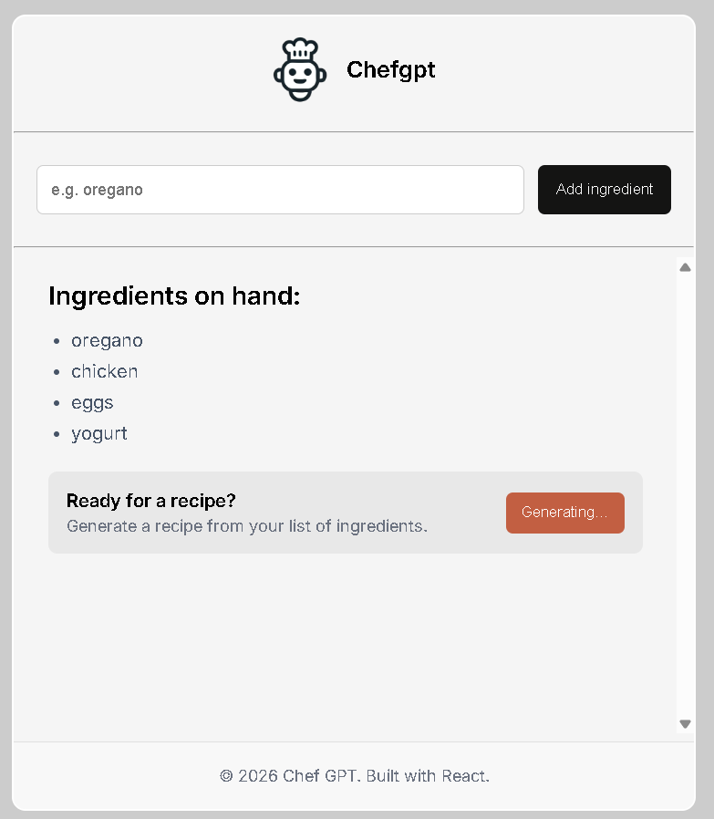
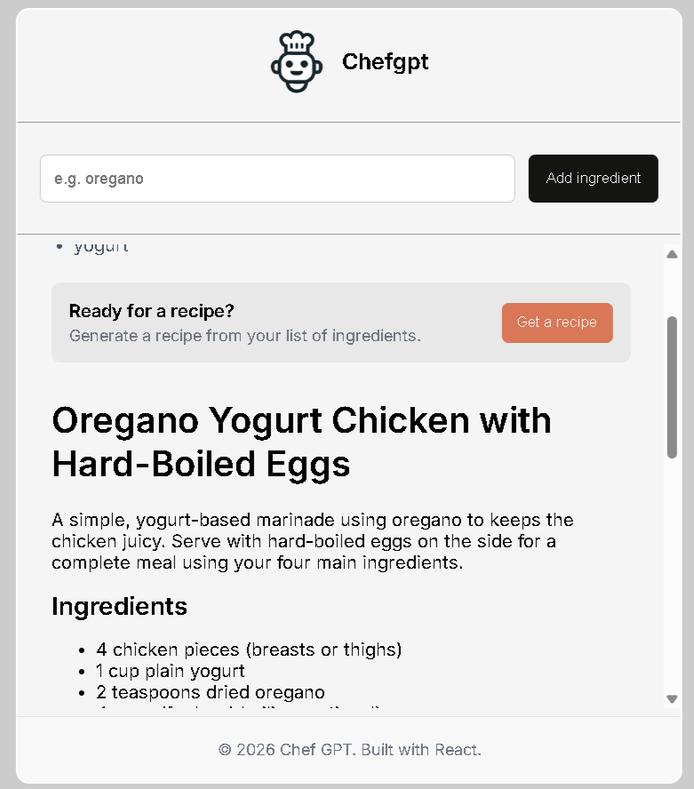
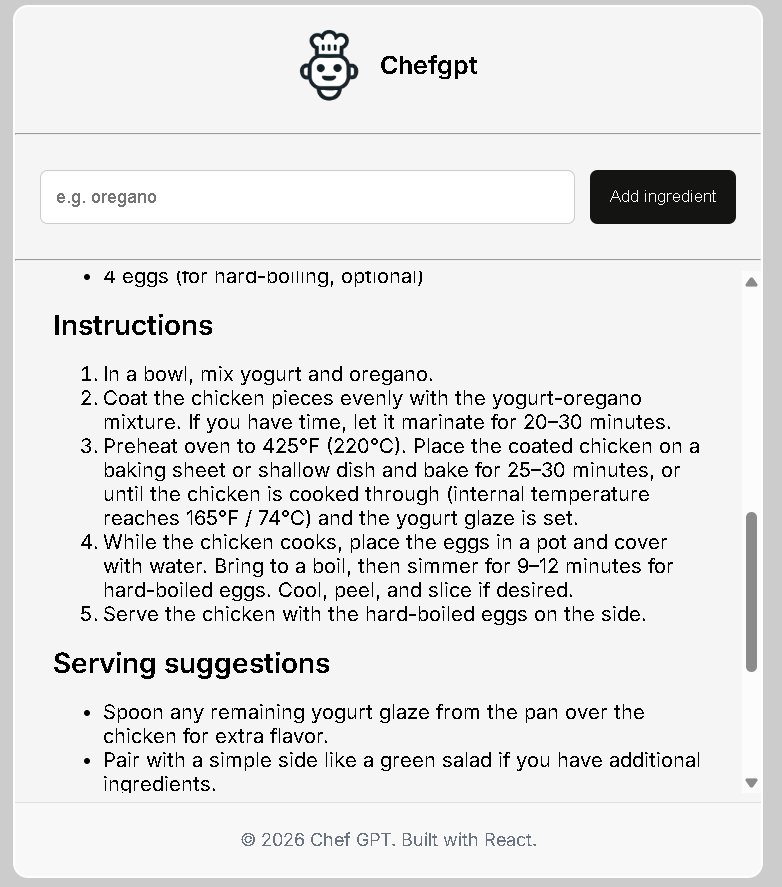

<h1 align="center" style="display: flex; align-items: center; justify-content: center; gap: 10px;">
  
  ChefGPT AI App
</h1>

ChefGPT is an AI-powered recipe generator built with React and OpenAI-compatible APIs.
Users can add ingredients they already have at home, and the AI generates a complete recipe in clean markdown format with headings, ingredients, instructions, and serving suggestions.

---

## 🚀 Features

* 🥘 Add ingredients dynamically
* 🤖 AI-generated recipes
* ✨ Clean markdown formatting
* 📜 Recipe streaming output
* ⏳ Loading state while generating
* 📱 Responsive mobile-first UI
* 🔐 Environment variable support for API keys
* ⚡ Built with React + Vite

---

# 📸 Screenshots

## Ingredient Input



---

## Recipe Generator Section



---

## Loading State



---

## AI Generated Recipe



---

## Recipe Instructions



---

# 🛠️ Tech Stack

* React
* Vite
* OpenAI API
* React Markdown
* CSS
* JavaScript

---

# 📂 Project Structure

```bash
src/
│
├── assets/
├── components/
│   ├── Header.jsx
│   ├── Footer.jsx
│   └── MainContent.jsx
│
├── UI/
│   ├── App.css
│   ├── footer.css
│   ├── header.css
│   └── maincontent.css
│
├── instructions.js
├── utils.js
├── App.jsx
└── main.jsx
```

---

# ⚙️ Installation

Clone the repository:

```bash
git clone https://github.com/ThisisAlam/chef-gpt-ai-app.git
```

Move into the project folder:

```bash
cd chef-gpt-ai-app
```

Install dependencies:

```bash
npm install
```

Start development server:

```bash
npm run dev
```

---

# 🔑 Environment Variables

Create a `.env` file in the root directory:

```env
VITE_AI_KEY=your_api_key
VITE_AI_URL=https://api.openai.com/v1
VITE_AI_MODEL=gpt-5-nano
```

---

# 🤖 AI Functionality

The app sends the ingredient list to an OpenAI-compatible API and streams the response in real time.

Example AI output includes:

* Recipe title
* Description
* Ingredients list
* Step-by-step instructions
* Serving suggestions

---

# 📜 Markdown Rendering

Recipes are rendered using:

```bash
react-markdown
```

This allows the AI to generate structured and readable recipe responses.

---

# 🎯 Learning Goals

This project was built to practice:

* React state management
* Async API handling
* Streaming AI responses
* Markdown rendering
* Environment variables
* Component architecture
* Conditional rendering

---

# 🌟 Future Improvements

* Save favorite recipes
* Dark mode
* Recipe history
* Voice input
* Image generation for recipes
* Backend API integration
* Authentication system

---

# 👨‍💻 Author

## Fakhar Alam

Full Stack Developer & AI Enthusiast

* GitHub: [ThisisAlam GitHub](https://github.com/ThisisAlam?utm_source=chatgpt.com)
* LinkedIn: [Fakhar Alam LinkedIn](https://www.linkedin.com/in/fakhar-e-alam-a046133b4/?utm_source=chatgpt.com)

---

# ⭐ Support

If you like this project, give it a star on GitHub ⭐
